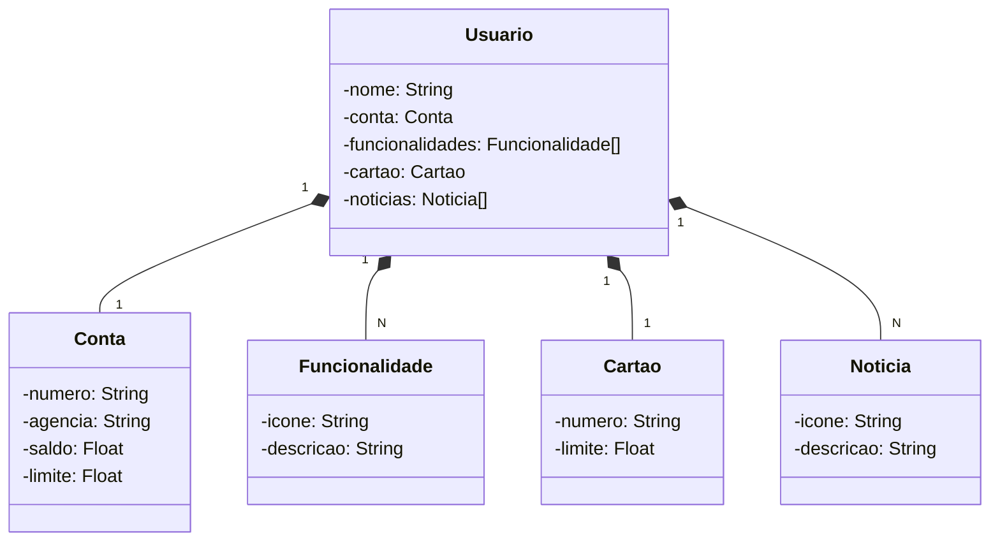

# 💰 Santander DIO Bootcamp - API REST na Nuvem

## 🎯 Objetivo

Este projeto é a solução para o Desafio de Projetos da DIO: **Publicando Sua API REST na Nuvem Usando Spring Boot 3, Java 17 e Railway**. Ele implementa uma API REST para simular funcionalidades de um banco digital, seguindo o projeto de referência:

[https://github.com/falvojr/santander-dev-week-2023](https://github.com/falvojr/santander-dev-week-2023)

## 🚀 Tecnologias Utilizadas

* **Spring Boot 3:** Framework para desenvolvimento rápido de aplicações Java.
* **Java 17:** Versão moderna do Java com recursos aprimorados.
* **Railway:** Plataforma para deploy e gerenciamento de aplicações na nuvem.
* **Spring Web:** Módulo para criação de APIs REST.
* **Spring Data JPA:** Simplifica o acesso a dados com bancos de dados relacionais.
* **H2 Database:** Banco de dados em memória para desenvolvimento e testes.
* **PostgreSQL Driver:** Driver para conexão com banco de dados PostgreSQL em produção.
* **Lombok:** Reduz o código boilerplate com anotações.
* **OpenAPI (Swagger):** Documentação interativa da API (adicionada manualmente).

## 💡 Melhorias Implementadas

* **Lombok:** Adoção da biblioteca Lombok para reduzir a verbosidade do código e aumentar a produtividade.
* **Estrutura de Pacotes:** Organização do código em pacotes para melhor legibilidade e manutenção.
* **Tratamento de Erros:** Implementação de tratamento de erros para respostas mais informativas ao usuário.

## Diagrama de Classes:

